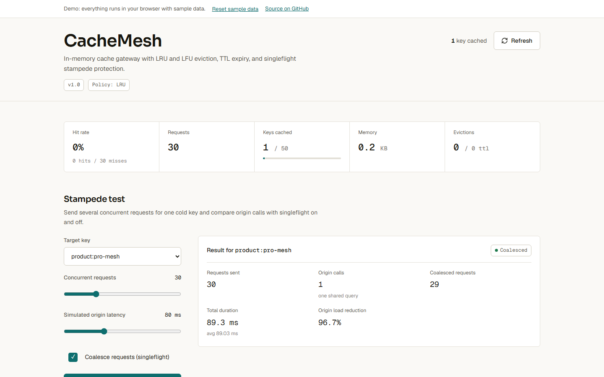
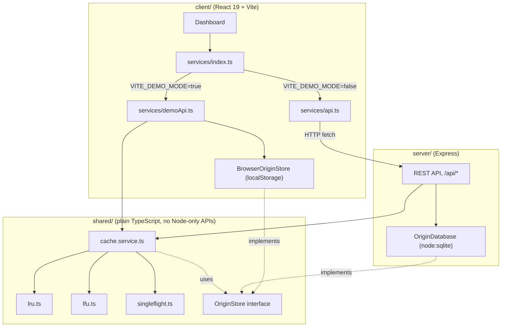

# CacheMesh

CacheMesh is an in-memory key-value cache gateway with LRU and LFU eviction, TTL expiry, wildcard invalidation, and singleflight stampede protection. It ships with a React dashboard for exploring the cache, running a cache-stampede simulation, and testing GET/SET/purge calls by hand.

[](https://github.com/Taan1el/cachemesh/actions/workflows/ci.yml)
[](https://github.com/Taan1el/cachemesh/actions/workflows/pages.yml)
[](LICENSE)

**Live demo:** https://taan1el.github.io/cachemesh/

The demo runs entirely in your browser: the same cache and eviction code the server uses runs against an in-memory, localStorage-backed store instead of a real API, so it works with no backend.

## Screenshot



More screenshots: [workbench and cache explorer](docs/screenshots/02-workbench.png), [pattern purge](docs/screenshots/03-purge.png).

## Features

- **O(1) LRU and LFU eviction**, switchable at runtime; switching policy transfers existing entries into the new structure instead of dropping them.
- **TTL per key**, expired lazily on access and by a periodic background sweep, so an expired key that is never read again still gets reclaimed.
- **Wildcard pattern invalidation** (`user:*`, `product:*`) for bulk purges.
- **Singleflight request coalescing**: when N concurrent requests miss the cache for the same key, exactly one origin call is made and the other N-1 share its result.
- **Live telemetry**: hit ratio, memory estimate, capacity usage, and eviction/expiry counts, refreshed every 3 seconds.
- **Stampede simulator**: fire a configurable number of concurrent requests at a key, with singleflight on or off, and see origin call count, coalesced count, and total duration.
- **Key explorer**: filter active keys, watch TTL countdowns, inspect a stored value, delete a key, or clear the cache.
- **GET/SET/purge/config workbench** for manual testing against the running cache.
- **GitHub Pages demo mode**: no backend required; data is seeded and persisted in your browser's localStorage, with a "Reset demo data" control.

## Getting started

### Prerequisites
- Node.js 22.5 or newer (built and tested on Node.js 24.14.1; `node:sqlite` needs 22.5+)
- npm 10 or newer (tested on npm 11.11.0)

### Install
```bash
git clone https://github.com/Taan1el/cachemesh.git
cd cachemesh
npm install
```

### Run
```bash
npm run dev
```
This starts the Express API on port 4002 and the Vite dev server on port 5173. Open **http://localhost:5173**.

### Environment variables
Neither variable is required to run the defaults shown above.

| Variable | Used by | Default | Purpose |
|---|---|---|---|
| `PORT` | server | `4002` | Port the Express gateway listens on. See `server/.env.example`. |
| `VITE_API_TARGET` | client (dev only) | `http://localhost:4002` | Where the Vite dev server proxies `/api` requests, for when the server runs on a different port. See `client/.env.example`. |

## Scripts

Run from the repo root unless noted otherwise.

| Script | What it does |
|---|---|
| `npm run dev` | Runs the server (`tsx watch`) and client (Vite) together |
| `npm run build` | Builds the server, then the client, for production |
| `npm run build:pages` | Builds the client in demo mode (`client/dist`), for GitHub Pages |
| `npm test` | Runs the server test suite, then the client test suite |
| `npm run lint` | Typechecks the server, then the client (`tsc --noEmit`) |
| `npm run bench` | Runs the cache engine benchmark (`server/scripts/bench.ts`) |

## How it works

`shared/` holds the cache logic used by both the server and the browser demo: `lru.ts` and `lfu.ts` (the eviction engines), `singleflight.ts` (request coalescing), and `cache.service.ts` (the coordinator that ties them to an origin store through the `OriginStore` interface). Neither the server's `OriginDatabase` (Node's native SQLite) nor the browser's `BrowserOriginStore` (an in-memory map persisted to localStorage) is part of `shared/`, because they use environment-specific APIs; each just implements `OriginStore`.



### Project layout

```
cachemesh/
  client/                 React 19 + Vite dashboard
    src/components/       Header, StatsBar, StampedeSandbox, CacheExplorer, OperationsPanel, DemoBanner
    src/services/         api.ts (real), demoApi.ts (browser), index.ts (the switch), browserOriginStore.ts
  server/                 Express API
    src/app.ts            Express app: CORS, JSON body parsing, API mount, static client build
    src/db/origin.ts       SQLite-backed OriginStore implementation
    src/controllers/       Request validation and response shaping
    src/routes/             Route table
    scripts/bench.ts       Cache engine benchmark
  shared/                 Cache logic used by both server and client (see above)
  docs/adr/               Architecture decision records
  docs/screenshots/       README screenshots
```

## API reference

All routes are mounted under `/api`. Errors are always `{ "success": false, "error": "..." }`; most successful responses are `{ "success": true, "data": ... }`, except `/api/health` (no wrapper) and `/api/cache/clear` (`{ "success": true, "message": "..." }`, no `data`). Checked against `server/src/routes/api.routes.ts` and `server/src/controllers/cache.controller.ts`.

| Method | Path | Body / query | Response data | Errors |
|---|---|---|---|---|
| GET | `/api/health` | - | `{ status, service, activeKeys, hitRatio, policy }` | - |
| GET | `/api/cache/stats` | - | `CacheStats` | 500 |
| GET | `/api/cache/entries` | - | `CacheItemMetadata[]` | 500 |
| GET | `/api/cache/item/:key` | query `delay?`, `singleflight?` | value plus `source`, `coalesced`, `latencyMs`, `metadata` | 400 empty key or invalid `delay`, 404 not found, 500 |
| POST | `/api/cache/item` | `{ key, value, ttlSeconds? }` | `{ key, evicted? }` | 400 invalid `key`/`ttlSeconds`, 500 |
| DELETE | `/api/cache/item/:key` | - | `{ key, deleted }` | 400 empty key, 500 |
| POST | `/api/cache/clear` | - | (message only) | 500 |
| POST | `/api/cache/purge` | `{ pattern }` | `InvalidationPatternResult` | 400 invalid `pattern`, 500 |
| POST | `/api/cache/config` | `{ capacity?, defaultTtlSeconds?, policy? }` | `CacheConfig` | 400 invalid field, 500 |
| POST | `/api/cache/stampede-demo` | `{ key, concurrentRequests, simulatedOriginDelayMs?, useSingleflight? }` | `StampedeDemoResult` | 400 invalid `key`/`concurrentRequests`/delay, 500 |
| GET | `/api/origin/entities` | - | `OriginEntity[]` | 500 |
| POST | `/api/origin/entities` | `{ id, category, name, payload? }` | `OriginEntity` | 400 invalid field, 500 |

Shapes (`CacheStats`, `CacheItemMetadata`, `CacheConfig`, `StampedeDemoResult`, `InvalidationPatternResult`, `OriginEntity`) are defined in `shared/types.ts`.

## Testing

- **Cache engines** (`server/test`): LRU and LFU eviction order and tie-breaking, TTL expiry (lazy and via the background sweep), wildcard purge including regex-metacharacter keys, singleflight coalescing under concurrency.
- **API** (`server/test`, via `supertest`): the happy path for every route, input validation (400s), the 404 path, and that error responses never leak internal detail.
- **Client** (`client/src/test`, React Testing Library): dashboard rendering and polling, the stampede sandbox, tab switching, accessible labels on every workbench field.
- **Demo adapter** (`client/src/test/demoApi.test.ts`): the seeded catalog, cold miss then warm hit, the not-found error message matching the real API, set/list/delete, purge, stampede coalescing, config validation, persistence across a new store instance, and reset.

Run everything with `npm test` (or `npm run test:server` / `npm run test:client` separately).

## Deployment

### Docker
```bash
docker compose up --build
```
Serves the built client and API together at **http://localhost:4002**. The image runs as the unprivileged `node` user. Docker was not available while preparing this repository, so the image is only verified by the `docker` job in CI (`docker build`); if `docker compose up` does not work for you, please open an issue.

### GitHub Pages
`.github/workflows/pages.yml` runs `npm run build:pages` and publishes `client/dist` on every push to `main`. The deploy step is skipped while the repository is private and starts working once it is made public.

## Design notes and limitations

- The cache is in-memory and local to one process: it is not shared across multiple server instances, and restarting the server clears it. Only the SQLite origin data persists.
- There is no authentication on the API. Anyone who can reach it can read, write, purge, or reconfigure the cache. Do not expose this server to the public internet as-is.
- Memory usage is an estimate based on serialized value length, not actual V8 heap usage.
- The GitHub Pages demo stores its data in the browser's localStorage: it is per-browser, not shared between visitors, and can be cleared by the browser (private windows, storage limits) at any time.
- This has not had a security review. Treat it as a demonstration of cache and stampede-protection techniques, not as a production cache in front of real traffic.

## Roadmap

- Optional API key or basic auth for the mutating endpoints.
- Persist cache snapshots so a restart does not start cold.
- An audit log of SET, DELETE, and purge operations.
- Push updates over WebSocket/SSE instead of polling every 3 seconds.

## License

MIT, see [LICENSE](LICENSE).
